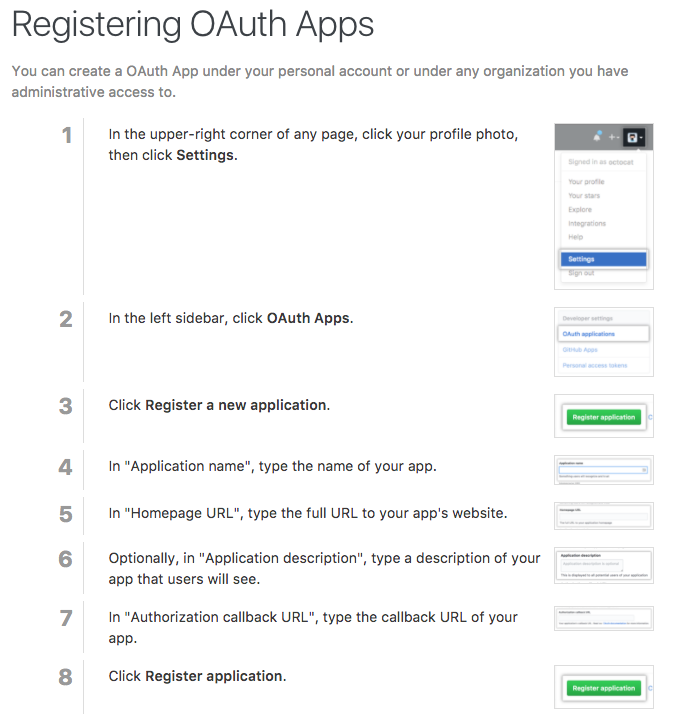

# Continuous Integration and Continuous Delivery solution for Kubernetes

This is a cut down version of the free OSS developer platform fabric8. This focuses on the Continuous Integration and Delivery features of from fabric8 using Jenkins Pipelines on Kubernetes or OpenShift.

## What's in the box?

- [Jenkins](https://jenkins.io/) and [Blue Ocean](https://jenkins.io/projects/blueocean/)
- Artifact repository (currently defaults to [Nexus](https://www.sonatype.com/nexus-repository-oss))
- [Keycloak](http://www.keycloak.org/) (Optional but needed for Single Sign On deployment)

## Prerequisits
### gofabric8

fabric8 uses a CLI that makes installing fabric8 locally or on remote Kubernetes based clusters very easy.

gofabric8 also has lots of handy commands that makes it easier to work with fabric8 and OpenShift / Kubernetes

### Download gofabric8

Download the latest gofabric8 release from [GitHub](https://github.com/fabric8io/gofabric8/releases/latest/) or run this script:
```
curl -sS https://get.fabric8.io/download.txt | bash
```
add the binary to your $PATH so you can execute it
```
echo 'export PATH=$PATH:~/.fabric8/bin' >> ~/.bashrc
source ~/.bashrc
```
or for __oh-my-zsh__
```
echo 'export PATH=$PATH:~/.fabric8/bin' >> ~/.zshrc
source ~/.zshrc
```
## Quickstart
### No auth
If you want to get going quickly with auth disabled in Jenkins then this command will download minikube, install drivers and deploy fabric8 jenkins:
```
gofabric8 start --namespace fabric8 --package=jenkins --legacy=false
```
If you're already connected to a Kubernetes or OpenShift cluster then run:
```
gofabric8 deploy --namespace fabric8 --package=jenkins --legacy=false
```
### Single Sign On
If you want Single Sign On (provided by Keycloak) then we currently support GitHub oauth (more to follow) out of the box.  This first requires a manual setup of an [OAuth application to be setup on your github account](https://developer.github.com/apps/building-integrations/setting-up-and-registering-oauth-apps/registering-oauth-apps/)

First of all we need to get a redirect URL to use.  You can get a suggested redirect URL by running:
```
echo "http://keycloak-fabric8.$(gofabric8 ip).nip.io/auth/realms/fabric8/broker/openshift-v3/endpoint)"
```
Note, replace `nip.io` with your own domain if use one during `gofabirc8 deploy` in the next step.

Now please follow the steps below using your redirect URL and `https://fabric8.io` as the sample 'homepage URL' when asked in GitHub:



Once you have created the OAuth application for fabric8 in your GitHub settings and found your client ID and secret then set the env vars below replacing the values:
```
export GITHUB_OAUTH_CLIENT_ID=123
export GITHUB_OAUTH_CLIENT_SECRET=123abc
```
Now deploy:
```
gofabric8 deploy --namespace fabric8 --package=jenkins-sso --legacy=false
```

# FAQ

### Why Nexus 2 and not Nexus 3?
We tried Nexus 3 but there was significant increase in build times so right now we deem it not usable.

To try it we have an app you can install:
```
kubectl apply -f http://central.maven.org/maven2/io/fabric8/apps/nexus3-app/1.0.0/nexus3-app-1.0.0-kubernetes.yml
```
You will need to modify the settings.xml in the maven settings secret as the mirror repository URL is different for Nexus3

### Why does Nexus not included in the SSO?
As far as we can tell Nexus 2 doesn't support OAUTH

### What's the credentials for Nexus?
We use the default:
`
admin/admin123
`
If you change this be sure to also update the settings.xml in the maven settings secret so the pipelines can continue to deploy artifacts there

### Can we use our own artifact repository?

Yes, the pipelines use a kubernetes service to deploy artifacts.  So if you have your own internal or external repository then you can modify the `artifact-repository` service that runs in the same namespace as Jenkins.  For external repos looks at using `ExternalName`, see this [link](https://kubernetes.io/docs/concepts/services-networking/service/#without-selectors) for more details.

Make sure to update the server section of the settings.xml in the maven settings secret, to include any new credentials.

### How do I add secrets so the build pipelines can push to dockerhub etc?

We create and mount dummy secrets into build pods already.  So you can base64 you tokens and update the secrets that we've already created for you.  You can also easily extend this and use your own pipeline library to mount different secrets.  For a list of current secrets we automatically mount, run `kubectl get secrets` after deploying fabric8 jenkins.